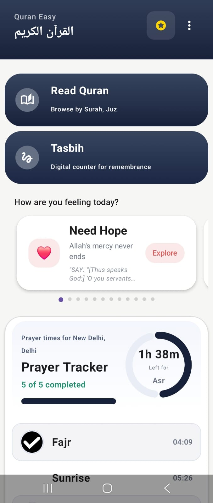
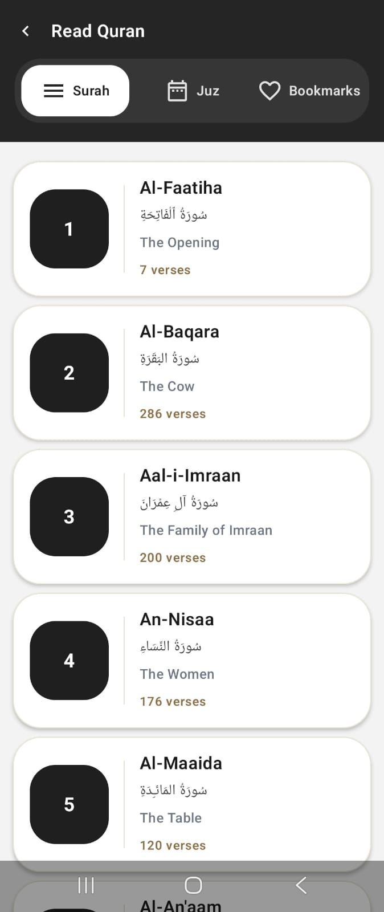
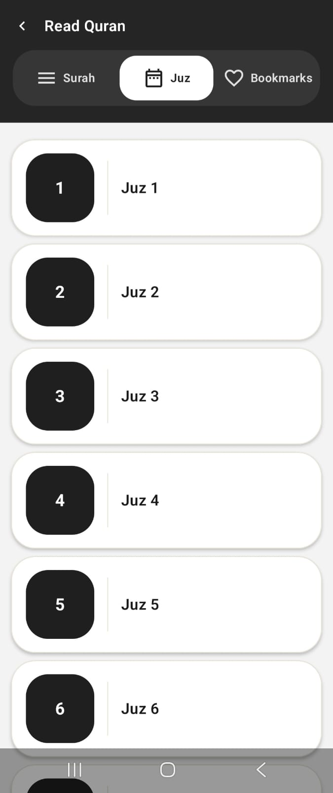
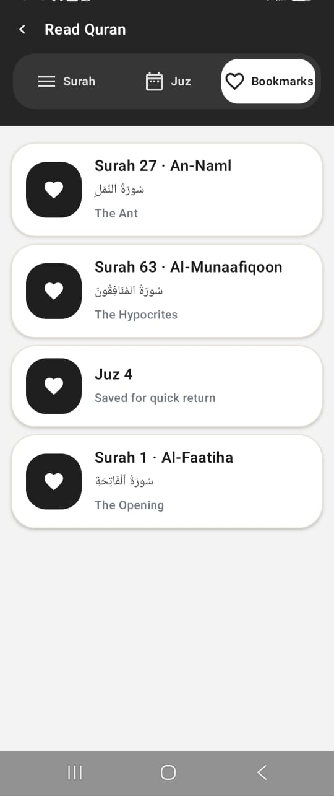
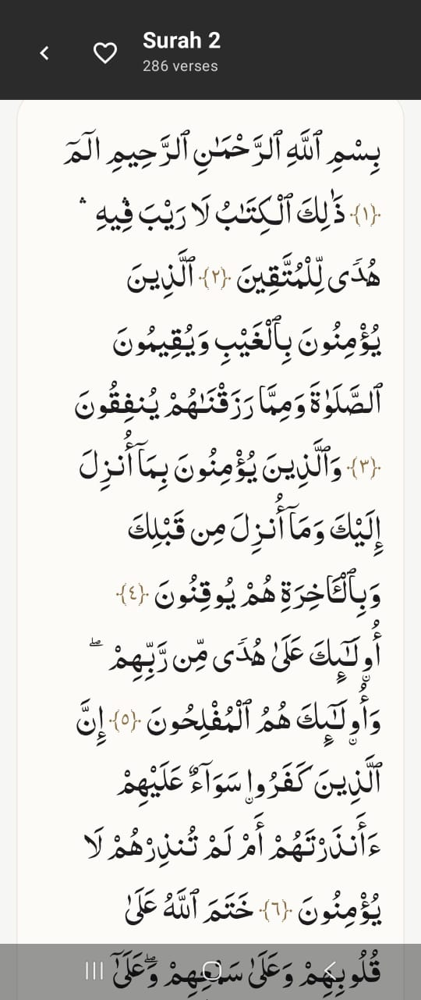
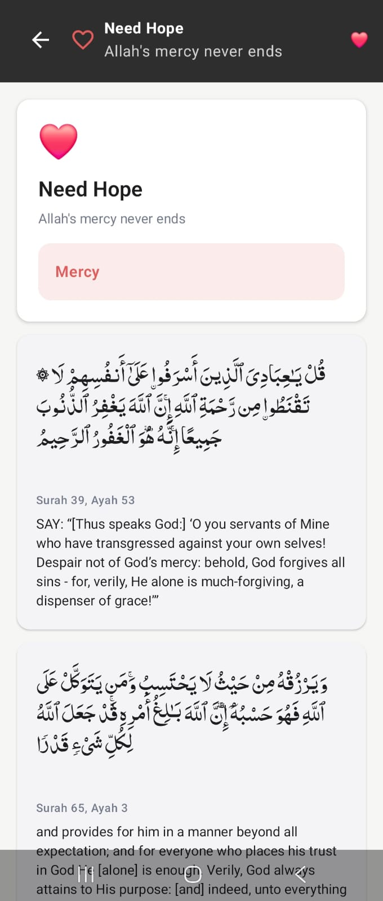
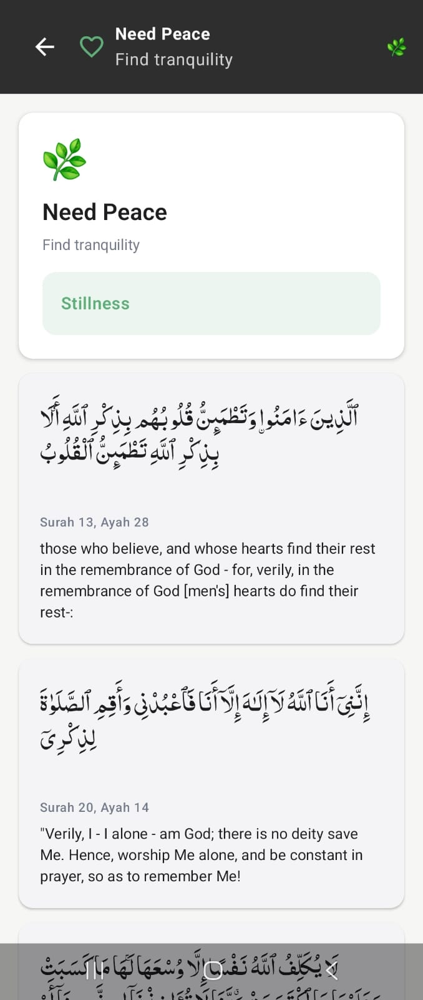
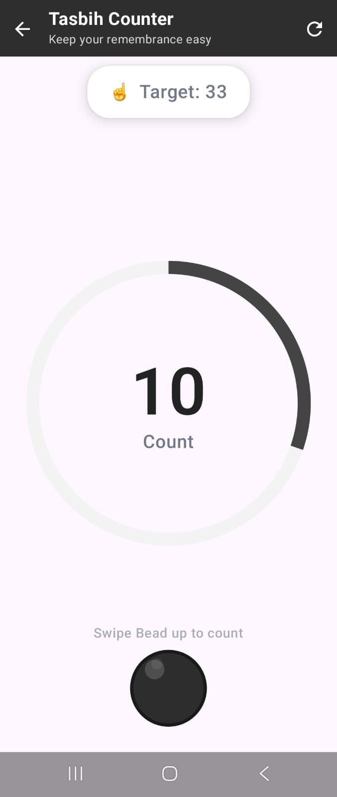

# Quran Easy

Quran Easy is an Android app built to support a calmer daily spiritual routine. It brings together Quran reading, prayer tracking, tasbih, and a unique Feeling feature that helps users discover relevant verses based on their emotional state.

## Features

- Read the Quran by `Surah` or `Juz`
- Continue quickly with saved bookmarks
- Open a focused Quran reader experience
- Track daily prayers with progress and upcoming prayer timing
- Use a digital tasbih counter with a target-based flow
- Explore the `Feeling` feature for emotion-based Quran guidance like hope and peace

## Feeling Feature

One of the core parts of Quran Easy is the Feeling feature. Instead of only browsing traditionally, users can choose how they feel and receive Quranic verses that match that moment.

Examples include:

- `Need Hope` for verses about mercy and encouragement
- `Need Peace` for verses about stillness, remembrance, and tranquility

This makes the app feel more personal, reflective, and supportive in everyday life.

## Screenshots

### Home

  

### Quran Reading

  
  
  
  

### Feeling

  
  

### Prayer And Tasbih

  
  

## Tech Stack

- Kotlin
- Jetpack Compose
- Android Navigation Compose
- Hilt
- Room
- Retrofit
- Moshi
- Coroutines and Flow

## Project Structure

- `app` - application entry point and navigation host
- `core` - shared UI, utilities, and reusable components
- `feature_home` - home dashboard
- `feature_quran` - Quran lists, reader, and bookmarks
- `feature_prayer` - prayer timings, tracking, and local persistence
- `feature_tasbih` - digital tasbih counter
- `feature_feeling` - emotion-based guidance and verse discovery

## Getting Started

1. Clone the repository.
2. Open the project in Android Studio.
3. Sync Gradle dependencies.
4. Run the app on an emulator or Android device.

## Status

Quran Easy is actively being improved with a focus on clean design, daily usability, and spiritually supportive features.
